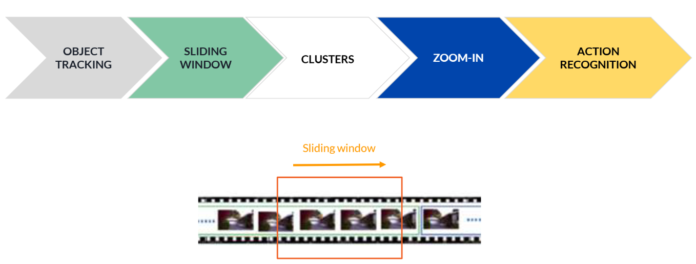
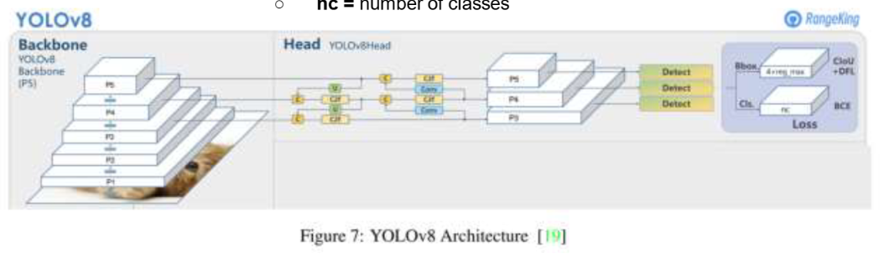
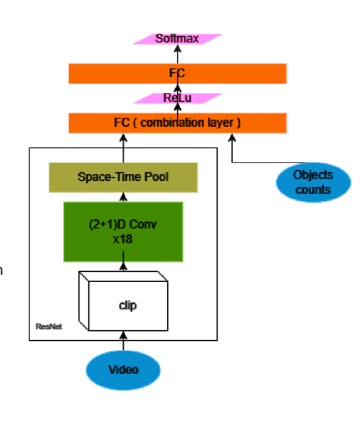

# Intelligent Surveillance 🇮🇹/🇬🇧 
## 🇮🇹 Italiano

**Disclaimer**: applicazione fatta per l'esame di _Computer Vision_, nel primo anno della facoltà magistrale di _AI & Robotics_ di _Sapienza Università di Roma_.

Le telecamere di sorveglianza tradizionali hanno un grosso limite: c'è sempre bisogno della supervisione umana, il che risulta ovviamente in un notevole calo di accuratezza. Per questo motivo è stato creato _intelligent-surveillance_, un sistema basato su modelli di IA per la sorveglianza automatica delle telecamere di sicurezza.
<u>Note</u>: il progetto è stato creato solo a scopo educativo, non intende promuovere o giustificare comportamenti eticamente discutibili.

## Come funziona

Il processo funziona seguendo il seguente algoritmo:

1. **Object detection** - alcuni oggetti di interesse sono identificati ( macchine, persone, motocicli... )
2. **Object tracking e clustering** - gli oggetti di interesse sono tracciati per un tempo definito e raggruppati, annotando le aree e zone del video di interesse.
3. **Action classifiation** - per ogni annotazione della fase precedente, una rete neurale classifica l'azione descritta nel video.

  

## 🤖 Modelli utilizzati

### YOLOv8 per object Recognition e Object Tracking
Per riconoscere gli oggetti nei video abbiamo usato YOLOv8. È stato scelto per la sua velocità e precisione. 

Una volta che sappiamo dove sono gli oggetti, bisogna seguirli frame per frame. Ogni oggetto ha la sua "carta d'identità" e possiamo seguirlo mentre si muove nel video.

  

### R2Plus1D-18 per classificazione di oggetti
Per l'action recognition viene fatto il fine tuning di una variante di una ResNet per i video, R2Plus1D-18. 

  

## Dataset

Abbiamo usato il dataset VIRAT:
- 250 ore totali di video di sorveglianza
- 13 tipi di oggetti diversi (persone, auto, ecc.)
- 41 tipi di azioni/eventi diversi

**Consigliato**: vedi la presentazione per maggiori dettagli.

---

## 🇬🇧 English

**Disclaimer**: this application was developed for the _Computer Vision_ exam during the first year of the Master's program in _AI & Robotics_ at _Sapienza University of Rome_.

Traditional surveillance cameras have a major limitation: they always require human supervision, which naturally results in a significant drop in accuracy. For this reason, _intelligent-surveillance_ was developed — a system based on AI models for automatic monitoring of security cameras.  
<u>Note</u>: this project was created solely for educational purposes and is not intended to promote or justify ethically questionable behavior.

## How It Works

The process works according to the following pipeline:

1. **Object detection** – objects of interest are identified (cars, people, motorcycles, etc.)
2. **Object tracking and clustering** – detected objects are tracked for a defined time window and grouped, annotating the relevant areas in the video.
3. **Action classification** – for each annotation from the previous phase, a neural network classifies the described action.

  

## 🤖 Models Used

### YOLOv8 for Object Detection and Object Tracking
To detect objects in the videos, we used YOLOv8. It was chosen for its speed and accuracy.

Once we know where the objects are, they must be tracked frame by frame. Each object has its own "identity card," allowing us to follow it as it moves through the video.

  

### R2Plus1D-18 for Action Classification
For action recognition, we fine-tuned a variant of ResNet for video, R2Plus1D-18.

  

## Dataset

We used the VIRAT dataset:
- 250 total hours of surveillance video
- 13 different object types (people, cars, etc.)
- 41 different action/event types

**Recommended**: check out the presentation for more details.

---

# How to use?
Note: Trained model are already available, so It's not mandatory to execute the training again.

Running the main program:
    0. Navigate to the folder "intelligent-surveillance"
    1. Run: python detector.py [video_path]
Some examples of videos are in the folder 'examples'.
Performances - mostly on action recognition - are low due to a lack of computational power for a good training process.
------------------------------------------------------------------------------------------------------------------------

Dataset processing steps:
    0. Navigate to the folder "intelligent-surveillance"
    1. Download VIRAT dataset "https://viratdata.org/#getting-data".
        The videos from: 'https://data.kitware.com/#collection/611e77a42fa25629b9daceba'
        The annotations from: 'https://gitlab.kitware.com/viratdata/viratannotations'
    2. Put all the videos and annotations in the same folders - respectively - './VIRAT/videos' and './VIRAT/annotations'
    3. Divide the videos in sub-videos and images useful for the models with: python ./preprocess_database.py 1
    4. Process the divided videos and images with: python ./preprocess_database.py 2
    5. Everything will be saved inside the folder ./dataset

Training YOLO model:
    0. Navigate to the folder "intelligent-surveillance"
    1. Run: python YOLO/train.py
    2. Results will be saved in YOLO/runs in a new created folder

Training Res2P1D model:
    0. Navigate to the folder "intelligent-surveillance"
    1. Run: python resnet/train.py
    2. Results will be saved in resnet/models overriding the existing weights

